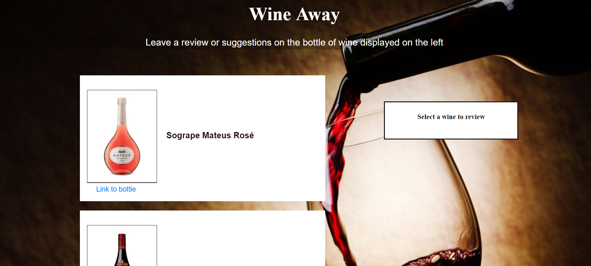
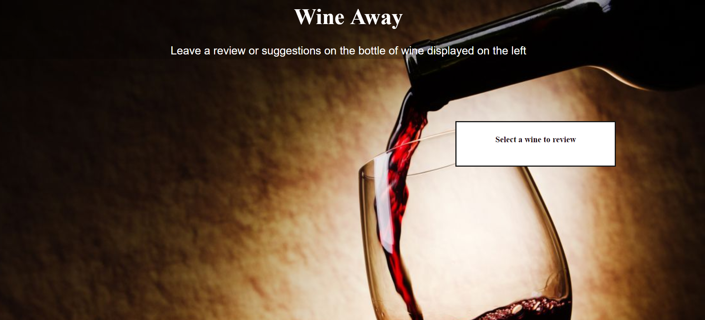
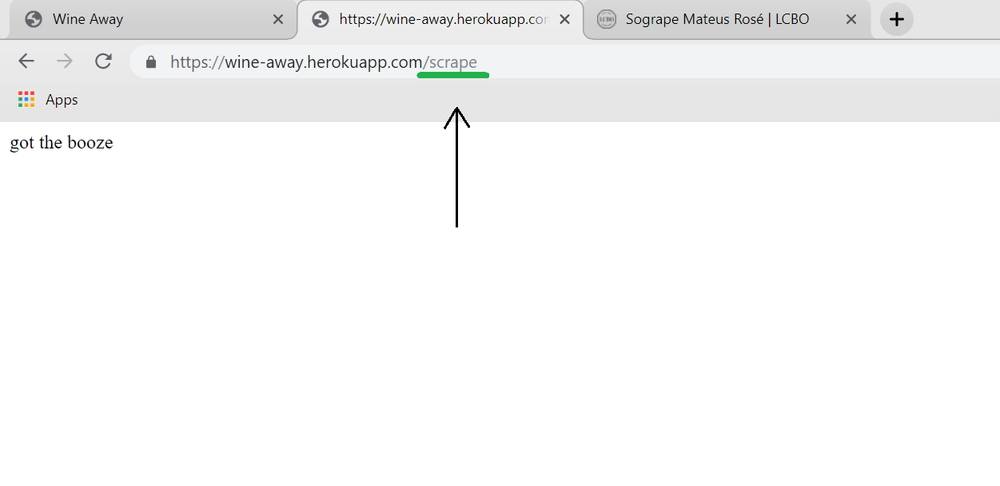

# Wine-Away
### Overview
An app where Wine connoisseurs can leave their comments or reviews about a bottle of wine found at our local LCBO. 
(bottle information and link scraped from the LCBO's library)

## Live Site
https://wine-away.herokuapp.com/

## Technologies and Frameworks
* Node.js
* Express
* Mongoose
* Cheerio
* Morgan
* MongoDB
* Axios
* Heroku
* REST API Principals
* JavaScript
* Bootstrap
* jQuery
* HTML
* CSS
* SASS

### Demo

Once you've entered the site, a list of wines scraped from the LCBO library will display on your bottom left screen. 
      

To review a bottle, click on the title of wine you would like to review and a text box will pop up, leave your review, and click save. 
      

Your review will be saved with the bottle, to see the review, simply click on the bottle title again. 
      

#### Improvements

As of now, the comment section does not append and new comments will erase previous comments. Future improvements will allow new comments to append instead of overwriting 

#### Troubleshoot

If the page does not show the bottles, it is likely the information has not been scraped from the LCBO site yet. Do the following steps to ensure that information has been scraped successfully. 
  

1. behind the url, type "/scrape"
   the following message should display.
      

2. navigate back to the home page by deleting "/scrape" from the end of the url, and the information should display. 
Our app will then return all washrooms that match the user's specification. 
      

## Authors
* **Tiffany Lin**         [Tiffolin](https://github.com/Tiffolin)

## Information source
 https://www.lcbo.com/webapp/wcs/stores/servlet/en/lcbo/wine-14

## License
MIT
